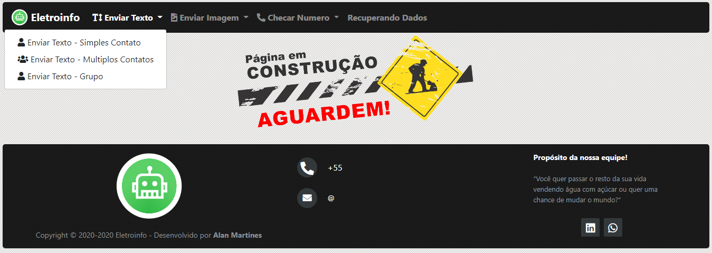

<p align="center">
  
</p>

# My Whats - Web
 Este projeto usa como base o [Venom-bot](https://github.com/orkestral/venom "Venom-bot"), um navegador virtual sem interface gráfica que abre o whatsapp web e executa todos os comandos via código possibilitando assim a automação de todas as funções, para uso dessse projeto necessario [mywhats-api](https://github.com/AlanMartines/mywhats-api "mywhats-api").

## Dependências
```bash
# Clone este repositório
$ git clone https://github.com/AlanMartines/mywhats-api-node.git

# Acesse a pasta do projeto no terminal/cmd
$ cd mywhats-api

# Instale as dependências
$ npm install

# Execute a aplicação 
$ node index.js
```
## Rodando a aplicação

```bash
# Ir para seu diretório home
$ cd ~

# Recuperar o script de instalação para sua versão de preferência
$ curl -sL https://deb.nodesource.com/setup_14.x -o nodesource_setup.sh

# Execute o script 
$ sudo bash nodesource_setup.sh

# Instalar o pacote Node.js
$ sudo apt install -y git nodejs yarn gcc g++ make

# Remover pacotes que não são mais necessários
$ sudo apt autoremove -y

# Clone este repositório
$ git clone https://github.com/AlanMartines/mywhats-web-php.git

# Acesse a pasta do projeto no terminal/cmd
$ cd mywhats-web

# Instale as dependências
$ npm install

# Execute a aplicação 
$ node index.js

# Manter os processos ativos a cada reinicialização do servidor
sudo npm install pm2 -g

pm2 start index.js

pm2 save

pm2 startup

sudo env PATH=$PATH:/usr/bin /usr/lib/node_modules/pm2/bin/pm2 startup systemd -u ${USER} --hp /home/${USER}

# O servidor iniciará na porta:8000

# Pronto, escaneie o código QR-Code do Whatsapp e aproveite!
```
## Uso
#### Acesso via web (Em desenvolvimento a integração/automatização)
http://localhost:8000/

#### Pagina inicial
<p align="left">
  
</p>

#### Menus
<p align="left">
  
</p>
<p align="left">
  
</p>
<p align="left">
  
</p>

## Dockerfile
```bash
# Ir para seu diretório home
$ cd ~

# Clone este repositório
$ git clone https://github.com/AlanMartines/mywhats-web-php.git

# Acesse a pasta do projeto no terminal/cmd
$ cd mywhats-web

# Processando o arquivo Dockerfile
$ docker build -t alanmartines/nodejs-mywhats-web-php:1.0 .

# Criar um contêiner
$ docker container run --name mywhats-web-php -p 8000:8000 -d alanmartines/nodejs-mywhats-web-php:1.0
```
## Para instalar o certbot e criar o certificado SSL para domínios https
```bash
sudo apt update

sudo apt install -y software-properties-common

sudo add-apt-repository universe

sudo add-apt-repository ppa:certbot/certbot

sudo apt update

sudo apt install -y certbot

sudo certbot certonly --manual --force-renewal -d *.yourdomain.net -d yourdomain.net --agree-tos --no-bootstrap --manual-public-ip-logging-ok --preferred-challenges dns-01 --server https://acme-v02.api.letsencrypt.org/directory
```

## Em desenvolvimento
Este projeto se encontra em desenvolvimento, então pode conter erros.

## License
[MIT](https://choosealicense.com/licenses/mit/)